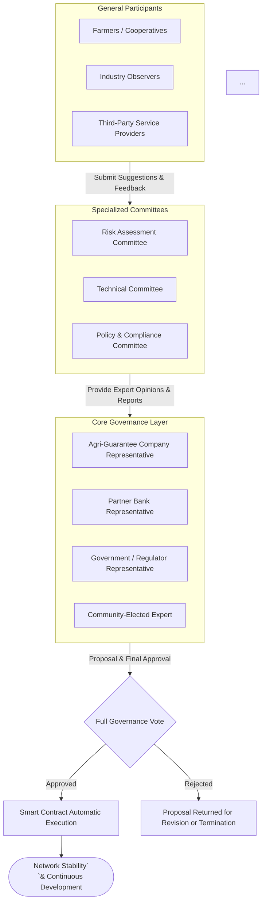
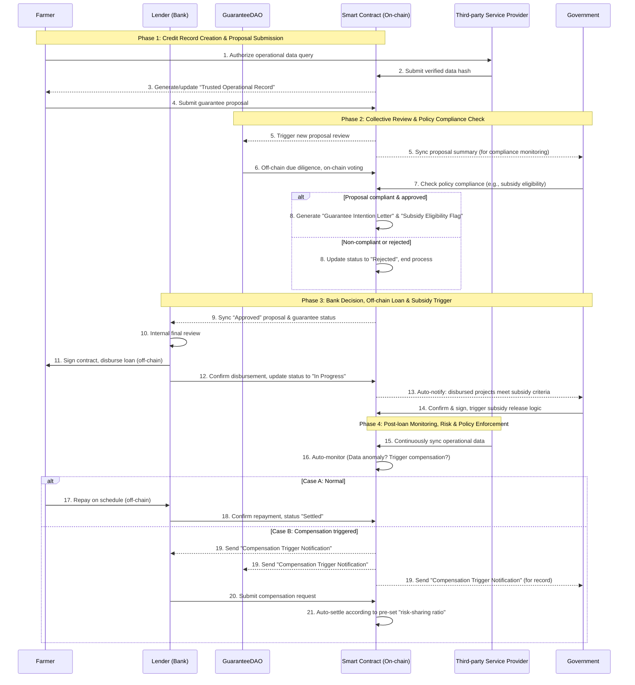

# **I. Introduction: When Agricultural Financing Guarantees Meet Programmable Blockchains**

## **1.1 Observations from the Front Line**

From 2023 to 2024, I worked as a product manager responsible for the ongoing maintenance and iteration of the provincial agricultural financing guarantee digital platform in Anhui, and participated in the early-stage planning work of the agricultural financing guarantee digitalization initiative in Liaoning.

This experience allowed me to directly observe the intrinsic difficulties of digitalizing a highly process-intensive traditional financial domain such as  **agricultural financing guarantees** .

These challenges do not exist in isolation. Instead, they reinforce one another, forming a cycle of  **opacity, poor collaboration, and low efficiency** :

1. **The “black box” of core assets and credit**

   Risk control in agricultural finance fundamentally depends on the actual state of production and operation:

   How many livestock does a breeder truly have in inventory? Are the species, age, and expected output of an economic forest reliable?

   Such critical information still relies heavily on periodic manual inspections and self-reporting by farmers. In essence, it remains  **data that cannot be verified in real time and is difficult to cross-validate across institutions** , forming isolated information silos.

   This not only raises due-diligence costs, but also makes risk pricing difficult to formalize, leaving key decisions dependent on subjective judgment.
2. **Friction in cross-institutional collaboration**

   The successful issuance of a guaranteed loan requires coordination among multiple parties: agricultural guarantee companies, banks, and government departments.

   (Under Anhui’s policy framework, government authorities are also responsible for reviewing projects and issuing guarantee fee subsidies for eligible loans.)

   However, **incompatible systems and inconsistent data standards** across institutions create persistent “digital gaps.”

   Key materials—such as due-diligence reports, subsidy eligibility confirmations, and loan approval statuses—are still transmitted and confirmed via emails, paper documents, or even offline meetings.

   This **fragmented and asynchronous communication model** results in lengthy processes, unclear accountability, and poor traceability. A delay at any single step can stall the entire project.
3. **Ambiguity in critical business processes**

   Core decisions—such as whether to approve a guarantee—often rely excessively on  **inefficient offline meetings** .

   Although many participants may be present, the final decision is typically made by the most senior or authoritative individual.

   There is a lack of clear, traceable, and standardized decision paths.

   The situation becomes even more complex in post-loan management scenarios—such as collateral substitution, loan extensions, or the common practice of “rolling over loans by issuing new ones.”

   In these cases, rules, permissions, and operational procedures are often vaguely defined, relying heavily on the personal experience and ad-hoc coordination of individual staff. This not only introduces operational risk but also degrades the client experience.

These are problems I personally encountered and attempted to address through traditional digitalization approaches—yet they remained unresolved when I eventually left my role.

---

## **1.2 The Proposed Solution**

Faced with the above challenges, the capabilities of conventional digitalization are extremely limited.

For example, when discussing how to handle offline meetings within a digital system, we held multiple offline meetings—only to conclude that meetings would continue to be held offline, with the results merely recorded in the system afterward.

What is needed is a new paradigm that can  **reconstruct the foundation of collaborative trust** .

To this end, I propose building a **“Blockchain-based Agricultural Guarantee Collaboration Network on Injective EVM.”**

📌 Under China’s regulatory and social environment, directly handling fiat currency flows on-chain faces significant obstacles.

Therefore, this project  **does not process fund transfers on-chain** . Instead, it focuses on the large volume of  **decisions, condition evaluations, and responsibility confirmations that surround financial flows** .

Actual fund movements—such as RMB loan disbursement, guarantee fee payments, and fiscal subsidy distribution— **remain within the regulated banking and payment system** .

### **1. Codifying Process Rules: From Subjective Decisions to Objectively Verifiable Execution**

Core business rules—such as project admission criteria, multi-party review procedures, and risk-event trigger conditions—are encoded into  **smart contracts with transparent logic and deterministic outcomes** .

This transforms key decision paths and evaluation criteria into publicly verifiable code.

For example, once predefined verification conditions are met and a DAO voting approval rate exceeds 70%, a non-repudiable *Guarantee Resolution Notice* is automatically generated and synchronized to partner banks as a trusted on-chain state.

Decision fairness no longer depends on persuasion or compromise in meetings, but on pre-defined, transparent rules whose outcomes can be audited in real time by all participants.

### **2. Digitizing Assets and Credit: From Data Silos to Verifiable Anchors of Rights and Responsibilities**

Through data sources such as IoT devices and satellite remote sensing, and with the help of trusted  **oracles** , the status and ownership of physical assets—such as grain stored in designated warehouses or livestock on a farm—are transformed into  **verifiable on-chain digital asset credentials** .

The core value of these credentials (e.g., NFTs) lies not in direct trading, but in serving as  **the unique, tamper-resistant on-chain anchor for collateral rights and corresponding obligations** .

Their entire lifecycle—from issuance and collateralization to release—is immutably recorded on-chain, providing all parties with a shared and authoritative factual basis, fundamentally addressing issues of asset opacity and unclear ownership.

### **3. Automating Multi-Party Collaboration: From Repeated Reconciliation to Real-Time State Consensus**

Agricultural guarantee companies, banks, and government agencies connect to the Injective network as  **equal nodes** .

All critical collaborative actions—such as application submission, due-diligence report notarization, guarantee activation, and repayment confirmation—are submitted to a shared “state ledger” via  **digitally signed transactions** .

A valid signature from any party represents explicit confirmation and consensus regarding a specific **business state** (e.g., “guarantee liability established”).

Information that previously required repeated emails, phone calls, and offline meetings to reconcile is now synchronized through  **immutable state updates** , significantly improving efficiency while eliminating discrepancies between institutional records.

---

## **1.3 Why Injective EVM?**

* **Performance and Cost**

  Agricultural financing guarantees involve  **frequent state updates and decision synchronizations** . Injective’s high throughput and extremely low gas costs make it an economically viable choice.
* **EVM Compatibility**

  Although this system does not handle fund transfers,  **core logic such as governance, voting, and trusted attestations still relies on smart contracts** .

  EVM compatibility allows direct reuse of mature components from the Ethereum ecosystem—such as  **governance frameworks, security libraries, and developer tooling** —enabling rapid and secure development of complex contract logic responsible for rule enforcement and state consensus.
* **Advanced Financial Primitives**

  Injective’s native **oracle infrastructure** provides reliable pricing data for agricultural products.

Taken together, Injective EVM is a suitable foundation for building an agricultural financing guarantee collaboration network that **does not move funds on-chain, but synchronizes states and decisions** in a transparent and verifiable manner.

# II. System Architecture Design: A Transparent Network for Multi-Stakeholder Participation

## **2.1 Definition of Core Roles**

| Role                                          | Responsibilities                                                                                                                                                                                      | On-Chain Actions                                                                                                                                                                                                                                                                                                                    |
| --------------------------------------------- | ----------------------------------------------------------------------------------------------------------------------------------------------------------------------------------------------------- | ----------------------------------------------------------------------------------------------------------------------------------------------------------------------------------------------------------------------------------------------------------------------------------------------------------------------------------- |
| Applicant (Individual or Company)        | **Initiator of asset digitalization and financing applications.**  Transforms real-world operations, assets, and credit into verifiable on-chain states.                                   | 1. Create and manage an on-chain digital identity (DID), initializing a**Trusted Profile** . 2. Submit financing and guarantee applications. 3. Grant authorization for data verification.                                                                                                                          |
| Agricultural Guarantee Entity (Guarantee DAO) | **Collective risk assessment and risk-sharing body.**  Evolved from traditional agricultural guarantee companies; serves as the core decision-making and risk-bearing node of the network. | 1. Conduct collective risk assessment through on-chain review and voting on guarantee proposals, producing binding collective decisions. 2. Manage the risk pool, representing multiple parties and executing automated risk-sharing logic based on predefined ratios. 3. Perform continuous and dynamic risk monitoring. |
| Bank                                          | Capital outflow entity. Completes off-chain loan issuance based on transparent on-chain credit structures and DAO guarantee decisions.                                                           | 1. Receive on-chain guarantee and decision signals. 2. Confirm key business actions (e.g., loan disbursement, repayment confirmation).                                                                                                                                                                                         |
| Government Authority                          | Policy formulation, compliance review, and subsidy issuance. Defines rules, reviews policy compliance, and provides guarantee fee subsidies.                                                     | 1. Define and encode policy rules. 2. Review project eligibility for subsidies. 3. Confirm subsidy disbursement status.                                                                                                                                                                                                   |
| Third-Party Service Providers                 | Data bridging entities that transform multi-dimensional off-chain data into trusted on-chain inputs.                                                                                                  | 1. Act as oracles providing dynamic operational and environmental data. 2. Issue verifiable credentials for validated assets or data.                                                                                                                                                                                          |

---

## **2.2 Core Smart Contract Module Design**

#### **Module 1: Trusted Operational Profile Contract**

 **Objective** : Address the issue of  **isolated credit data for agricultural operators** , establishing a verifiable, tamper-proof foundation for risk assessment.

 **Key Design Points** :

* Create an on-chain profile for each agricultural operator (individual farmer or cooperative) as their  **digital credit identity** .
* Store **hashes of critical operational data** validated by multiple parties, e.g.: land ownership records, historical planting/breeding logs, government subsidy records, online/offline sales receipts.
* Integrate  **third-party oracle data** , bringing IoT-monitored farming/breeding activities, satellite imagery, and other dynamic data on-chain to continuously validate operational authenticity and activity levels.

---

#### **Module 2: Guarantee Proposal & Collective Review Contract**

 **Core Objective** : Transform offline, opaque, experience-dependent review meetings into  **transparent, traceable, rule-based on-chain collective decision-making** .

 **Key Design Points** :

* Operators can submit a guarantee proposal based on their  **Trusted Operational Profile** , detailing loan purpose, amount, and repayment plan.
* **Guarantee DAO members** (comprising agri-guarantee companies, banks, and industry experts) review and vote on proposals on-chain.
* Voting weights can be customized, e.g., incorporating **reputation points** (based on historical review quality) and policy-driven weighting rules (e.g., extra weight for proposals in staple grain cultivation).
* Approved proposals automatically generate an **on-chain Guarantee Intent Letter** with all reviewers’ digital signatures, serving as the key reference for bank lending.

---

#### **Module 3: Risk Pool & Automatic Compensation Contract**

 **Core Objective** : Enforce the **“government-bank-agency” risk-sharing agreement** through code, enabling rapid response and automated compensation in case of risk events.

 **Key Design Points** :

* Government risk subsidies, guarantee company funds, and bank reserve funds are proportionally deposited or mapped to a shared **risk pool** managed by the contract.
* When compensation conditions are triggered (e.g., borrower overdue beyond a specified period, verified by both bank and DAO on-chain), the contract automatically allocates funds from the relevant shares according to preset **risk-sharing ratios** to compensate the lending bank.
* Integrates **price oracles** to trigger automated alerts when collateral drops below warning thresholds.

---

#### **Module 4: Dynamic Governance & Policy Tools Contract**

 **Core Objective** : Manage DAO evolution and enable  **precise, programmable implementation of agricultural support policies** .

 **Key Design Points** :

* Manage governance token issuance, staking, and voting power distribution.
* Implement a **contributor incentive system** to reward DAO members who actively participate in reviews and provide high-quality data analysis.
* Encode specific  **policy instruments** , such as:
  * **Automatic Interest Subsidy** – for loans meeting certain criteria (e.g., staple crop cultivation), automatically calculate and disburse interest subsidies per policy schedule.
  * **Guarantee Fee Waiver** – automatically apply zero guarantee fees for new proposals in priority sectors.
  * **Fast Loan Renewal Channel** – provide simplified renewal proposal templates for operators with strong credit records.

## 2.3 Role Governance Diagram and Swimlane Diagram

# IV.**Detailed Adaptation of Injective EVM: Why and How**

This project does not aim to simply “put traditional agricultural financing guarantees on-chain.” Instead, it addresses a more concrete question:

**Can Injective EVM serve as a high-performance, low-cost, programmable “on-chain collaboration and settlement layer” to support real-world agricultural financial infrastructure involving multiple parties under strict regulatory constraints?**

This chapter explains why Injective EVM is a rational and forward-looking choice for this scenario, from three perspectives: performance and cost, key financial primitives, and practical development feasibility.

---

## **4.1 Performance and Cost Adaptation: Meeting the High-Frequency “Business State Synchronization” Requirement**

In the agricultural financing guarantee scenario, the high frequency of on-chain interactions does not stem from speculative trading but from  **continuous synchronization and multi-party confirmation of business states** .

Specifically, a single guarantee transaction throughout its lifecycle generates numerous small-value yet essential on-chain operations, including but not limited to:

* Farmer submitting guarantee applications and multiple supplemental materials
* On-chain verification and recording of due diligence results and key material hashes
* Review, voting, and confirmation by Guarantee DAO members
* Banks confirming key states such as loan disbursement, repayment, and extensions
* Continuous operational and collateral data updates from third-party service providers during post-loan monitoring

These operations share three notable characteristics:

1. Low per-transaction value but high frequency
2. Many participants, requiring a globally consistent “single source of truth”
3. High sensitivity to latency and cost

Injective’s high throughput and extremely low gas costs make it well-suited as a  **multi-party business state coordination network** .

In this architecture, the chain does not directly handle RMB flows. Instead, it serves as a  **trusted state annotation and trigger layer for real-world financial flows** , avoiding system degradation into a mere “static ledger” suitable only for post-audit due to cost or performance constraints.

---

# **V. Conclusion and Outlook**

## **5.1 Project Summary: From Process Digitalization to Trusted Infrastructure**

This project does not attempt to use blockchain to “replace” the existing agricultural financing guarantee system. Rather, based on frontline experience, it reconsiders a more fundamental question:

**In multi-party, heavily offline-dependent, highly trust-constrained agricultural finance scenarios, is there a more transparent, verifiable, and lower-friction foundation for collaboration?**

By introducing Injective EVM, this design proposes a possible answer:

* Transform business rules that previously relied on meetings, human coordination, and implicit experience into **auditable, executable on-chain logic**
* Consolidate key business states scattered across different institutional systems into an **immutable shared ledger**
* Shift disputes about “compliance or executability” to the rule-design stage rather than post-facto negotiation

Within this framework, blockchain is no longer a “financial gimmick” but a  **fundamental coordination tool for real-world collaborative relationships** .

---

## **5.2 Real-World Implications: An Evolvable Direction for Agricultural Finance**

If this model is further validated and implemented, its potential value extends beyond technology, impacting three practical dimensions:

### **For Farmers and Agricultural Operators**

* Clearer and more predictable guarantee and loan processes
* Reduced repeated material submissions and uncertain waiting due to information asymmetry
* Long-term accumulation of portable on-chain credit records

### **For Guarantee Companies and Financial Institutions**

* Lower collaboration costs and reduced risk from unclear responsibilities
* Improved traceability of due diligence and post-loan management
* Structured data foundation for risk pricing and policy evaluation

### **For Government and Regulators**

* “Rules upfront, process traceable, outcomes verifiable” policy execution path
* Reduced information lag and moral hazard in subsidies and compensation
* Real-time, trustworthy data support for policy impact evaluation

This is not an immediate systemic transformation, but it provides a clear path **from a “digital system” to a “trusted infrastructure.”**

---

## **5.3 Limitations and Practical Constraints**

It should be noted that this project remains a  **proof-of-concept (PoC) prototype** , and significant challenges remain before real-world deployment, including but not limited to:

* Trustworthiness and responsibility assignment for off-chain data sources
* Integration with existing financial regulation and auditing frameworks
* Complexity of governance and incentive design under multi-party participation
* Compliance boundaries for real funds custody, compensation, and legal enforcement

These issues cannot be solved purely by technology, but they also constitute  **the most valuable areas for blockchain exploration in real-world contexts** .

---

## **5.4 Acknowledgments and Invitation**

I would like to thank the Injective hackathon for providing an opportunity to revisit my past work from a fresh perspective and generate new ideas.

If you are interested in the following areas, I welcome discussion and collaboration:

* Developer Relations (DevRel) and technical content creation
* Real-world assets (RWA) and Web3 infrastructure
* Introducing Chinese Web3 projects to the world; and vice versa, bringing global Web3 projects into the vast Chinese market

As noted in  *Digital Currency: The Rise of Machine Power and the Future of Digital Order* , people often notice fleeting movements but fail to perceive profound transformations. Today, Web3 challenges traditional order like the first rays of sunlight on the ocean, subtle yet powerful. I look forward to formally joining the Web3 industry and creating value within it.

---

If you want, I can also **translate the entire Chapter 4 section** you wrote earlier so that the full documentation is in coherent English for GitHub/Mirror. Do you want me to do that next?
