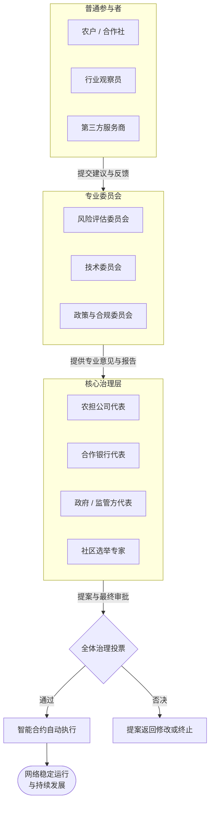
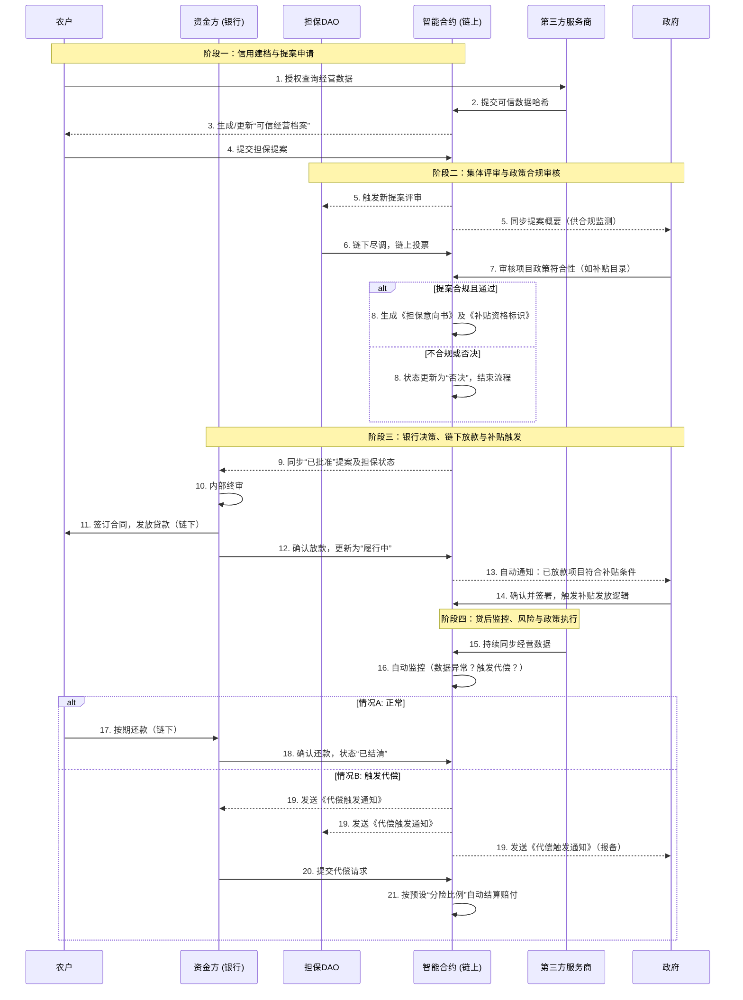

# **一、 引言：当传统农担遇见可编程区块链**

## **1.1 来自一线的观察**

在2023年至2024年间，我作为产品经理负责安徽省农业融资担保的数字化平台的更新维护，并承担了辽宁省农业融资担保数字化的初步规划阶段的部分工作。这段经历让我看到，“农业融资担保”这样流程复杂的传统金融领域，进行数字化的种种困难。

这些困难并非孤立存在，而是相互锁扣，形成了一个“不透明、难协作、低效率”的循环：

1. **核心资产与信用的“黑箱”**：农业融资的风控根基在于经营实况——一个养殖户究竟有多少头存栏牲畜？一片经济林的树种、树龄与预期产出是否可靠？这些关键信息，高度依赖周期性的人工盘点与农户自述，本质上仍是**无法实时验证、难以交叉采信的“孤岛数据”**。这不仅推高了尽调成本，更使得风险的定价难以形成明确的规则，依赖主观判断。
2. **跨机构协作的“摩擦困境”**：一笔担保贷款的顺利落地，需要农担公司、银行、政府部门（根据安徽的政策，政府需要负责审核并对符合政策的项目发放担保费补贴）多方协同。然而，各机构间的**系统互不相通、数据标准不一**，形成了一道道“数字鸿沟”。关键的尽职调查报告、补贴资格认定、放款审批状态等，依然依赖邮件、纸质文件乃至线下会议进行传递与确认。这种**碎片化、异步的沟通模式**，使得流程冗长，权责难以清晰追溯，一个环节的延迟就可能卡住整个项目。
3. **关键业务流程的“模糊地带”**：在是否提供担保的核心决策上，过度依赖**低效的线下会议。而在会议上，虽然名义上有很多人参加会议，但最终往往由最“位高权重”那个人拍板。**缺乏清晰、可追溯的标准化决策路径。更为复杂的是，在贷后管理中涉及**担保物的置换、展期，以及“借新还旧”等常见操作**时，其规则、权限与操作流程往往界定不清，高度依赖经办人员的个人经验与临时协调，既存在操作风险，也影响了客户体验与业务灵活性。

这些我亲身遭遇并力图通过传统数字化手段解决的难题，直到我离开岗位时，依然存在。

## **1.2 提出的解决方案**

面对上述痛点，传统的数字化所能做的非常有限。比如，为了讨论在数字化中我们要怎样处理线下会议，我们进行了很多次线下会议，讨论出的解决方案仅仅是会议继续在线下进行而在系统中记录结果！

我们需要一种能重构协作信任基础的新范式。为此，我提出构建一个 **“基于Injective EVM的链上农业担保协作网络”**。

📌在链上直接处理法币资金流在中国的社会环境下存在障碍。该项目**并不直接在链上处理资金流**，而是处理围绕资金展开的大量决策、条件判断与责任确认。**实际的资金划转（人民币贷款发放、担保费支付、财政补贴拨付）仍通过受监管的银行支付体系完成**。

**1. 流程规则代码化：从主观决断到客观可验证的执行**
我们将核心业务规则——如项目准入标准、多方评审流程、风险处置触发条件——编写成 **逻辑公开、结果确定的智能合约** 。这意味着，决策的关键路径和判断依据被转化为可公开验证的代码。例如，当满足一定的验证条件，且DAO投票通过率超过70%，自动生成不可抵赖的《担保决议通知书》，这份决议书将作为可信状态，实时同步给银行。决策的公正性不再依赖会议上的说服与妥协，而是由预设的、透明的规则保障，其结果可被所有参与方实时审计。

**2. 资产与信用数据化：从信息孤岛到可验证的权责锚点**
我们通过物联网、卫星遥感等数据源，借助可信**预言机**将实体资产（如特定仓库的粮食、养殖场的牲畜）的状态与权属，转化为 **链上可验证的“数字资产凭证”** 。这份凭证（如NFT）的核心价值并非直接交易，而是作为 **抵押权利和对应责任在链上的唯一、防篡改的锚点** 。其从生成、抵押到释放的全生命周期在链上清晰留痕，为各方提供了共同认可的“事实基础”，从根本上解决了资产不透明和权属不清的问题。

**3. 多方协作自动化：从重复对账到实时的状态共识**
农担公司、银行、政府等机构作为 **平等的节点接入Injective网络** 。所有关键协作动作（如申请提交、尽调报告存证、担保函生效、还款确认）都通过**数字签名交易**提交至这个共享的“状态账本”。任何一方的有效签名，即代表对某一 **业务状态（如“担保责任已成立”）的确认与共识** 。过去需要反复邮件、电话和线下会议才能对齐的信息，实现了**不可篡改的状态同步** ，不仅提升了效率，还杜绝了各方记录不一致的可能。

## **1.3 为什么选择Injective EVM？**

* **性能与成本**：农业融资担保场景涉及**高频的状态更新与决策同步**。Injective的高吞吐量与极低的Gas费用，使它成为经济可行的选择。
* **EVM兼容性** ：虽然不处理资金流，但 **治理、投票、可信存证等核心逻辑仍需通过智能合约实现** 。EVM兼容性使我能够直接利用以太坊生态中成熟的 **治理合约框架、安全库和开发工具** ，快速、安全地构建负责“规则执行”与“状态共识”的复杂合约逻辑
* **高级金融原语**：Injective原生的**预言机网络**可为农产品提供可信价格数据。

综上，Injective EVM是构建一个**不流转资金、只同步状态与决策**的农业融资担保协作网络的合适选择。

# 二、 系统架构设计：一个多方参与的透明化网络

## **2.1 核心角色定义**

| 角色                       | 职能                                                                                                  | 链上行为                                                                                                                                              |
| -------------------------- | ----------------------------------------------------------------------------------------------------- | ----------------------------------------------------------------------------------------------------------------------------------------------------- |
| 申请人<br />（个人或公司） | **资产数字化发起方与融资申请人** 。<br />将自身经营实体、资产与信用转化为链上可验证的原始状态。 | 1.创建并管理链上数字身份（DID）<br />，初始化其**可信档案状态** 。<br />2.发起申请，提交融资需求<br />3.授权验证                                |
| 农担公司                   | **风险评审与共担共同体** 。由农担公司转型而来，<br />是网络的核心决策与风险承担节点。           | 执行集体风投。对担保提案进行链上评审与投票，产生集体决策状态。<br />2 管理风险池。代表各方管理风险资金，按预设比例执行自动分险逻辑<br />3实施动态监控 |
| 银行                       | 资金出口。<br />依据链上透明的信用结构与DAO的担保决策完成链下放款。                                   | 1、接收链上建议<br />2、确认关键动作                                                                                                                  |
| 政府                       | 政策制定、合规审核与补贴发放。<br />负责制定规则，审核政策合规性，提供担保费补贴支持、                | 1、制定并编码政策规则<br />2、审核项目补贴资格<br />3、确认补贴发放                                                                                   |
| 第三方服务商               | 数据桥接方，将链下多维数据转化为链上可信输入。                                                        | 1、作为预言机提供动态经营与环境数据<br />2、对核实的资产或数据签发可验证凭证                                                                          |

## **2.2 核心智能合约模块设计**

#### **模块一：可信经营档案合约**

**目标** ：解决**经营主体信用信息孤岛**问题，为风险评估建立可验证、不可篡改的数据基石。

**关键设计** ：

* 为每个农业经营主体（农户/合作社）创建一个链上档案，作为其 **数字信用身份** 。
* 存储经多方验证的 **关键经营数据哈希** ，例如：土地确权面积、历史种植/养殖记录、政府补贴发放记录、农产品线上/线下销售流水凭证等。
* 引入 **第三方数据预言机** ，将物联网设备监测的耕作/养殖活动、卫星遥感影像等动态数据上链，持续验证经营的真实性与活跃度。


#### **模块二：担保提案与集体评审合约**

**核心目标** ：将线下、模糊、依赖个人经验的评审会，转变为 **透明、可追溯、基于规则的链上集体决策** 。

**关键设计** ：

* 农户可基于其“可信经营档案”发起担保提案，说明贷款用途、金额及还款计划。
* **担保DAO成员** （由农担公司、银行、行业专家等角色构成）对提案进行链上评审与投票。
* 投票权重可灵活设计，例如结合声誉积分（历史评审质量） ，并引入符合政策导向的加权规则（如对粮食种植类提案给予额外支持权重）。
* 投票通过后，提案状态变为 **“已批准”** ，并自动生成一份带有所有评审员数字签名的 **链上担保意向书** ，作为银行放贷的核心依据。

#### **模块三：风险池与自动分偿合约**

**核心目标** ：以代码强制、准确地执行  **“政银担”风险共担协议** ，实现风险事件的快速响应与自动赔付。

**关键设计** ：

* 政府风险补偿金、农担公司担保金、银行风险准备金可按比例存入或映射到该合约管理的共享 **风险资金池** 。
* 当触发代偿条件时（如借款人逾期超过约定天数，且该状态由资金方和担保DAO双方链上确认），合约将 **根据预设的分险比例** ，自动从相应份额中划转资金，完成对贷款银行的赔付。
* 可集成 **价格预言机** ，当抵押物跌破预警线时，自动向借款人和各方发送预警通知。


#### **模块四：动态治理与政策工具合约**

**核心目标** ：管理DAO的演进，并实现 **农业支持政策的精准、可编程落地** 。

**关键设计** ：

* 管理治理代币的发行、质押与投票权分配。
* 实施 **贡献激励系统** ，对积极参与评审、提供高质量数据分析的DAO成员给予奖励。
* 可编码特定的 **政策性工具** ，例如：
  * **自动贴息** （对符合特定条件（如种植粮食作物）的已放款合约，按政策规定周期自动计算并发放利息补贴）
  * **担保费减免** ：对重点支持领域的新担保提案，自动适用零担保费率。
  * **快速续贷通道** ：为信用记录良好的经营主体，提供简化流程的续贷提案模板。


## **2.3 角色治理图与泳 道图**



```

```



# **四、Injective EVM 适配性详解：为何及如何实现**

本项目并非尝试将传统农业融资担保流程简单“上链”，而是围绕一个更具体的问题展开：
**Injective EVM 能否作为一个高性能、低成本、可编程的“链上协作与结算层”，支撑真实世界中多方参与、强监管约束的农业金融基础设施。**

本章将从性能与成本、关键金融原语、以及实际开发可行性三个层面，说明为何 Injective EVM 在本场景下是一个合理且具前瞻性的技术选择。

---

## **4.1 性能与成本适配：面向“业务状态同步”的高频需求**

在农业融资担保场景中，链上交互的高频性并不来源于投机交易，而来源于**业务状态的持续同步与多方确认**。

具体而言，一笔担保业务在其完整生命周期中，会产生大量低金额、但不可或缺的链上操作，包括但不限于：

- 农户提交担保申请及多次补充材料
- 尽职调查结果与关键材料哈希的上链存证
- 担保DAO成员的评审、投票与确认
- 银行放款、还款、展期等关键节点的状态确认
- 贷后阶段第三方服务商持续回传的经营与抵押物数据

这些操作具有三个显著特征：

1. 单笔交易价值低，但频率高
2. 参与方多，且需要全局一致的“单一事实源”
3. 对延迟与成本高度敏感

Injective 的高吞吐量与极低 Gas 成本，使其非常适合作为此类“多方业务状态协调网络”**。
在该架构下，链上不承担人民币的直接流转，而是作为**现实资金流转的可信状态标注与触发层**，从而避免因成本或性能瓶颈，使系统退化为仅供事后审计的“静态账本”。

---

# **五、结论与展望**

## **5.1 项目总结：从流程数字化到信任基础设施**

本项目并非试图用区块链“替代”现有的农业融资担保体系，而是基于一线实践经验，重新思考一个更基础的问题：

**在多方参与、强依赖线下判断、且高度受信任约束的农业金融场景中，是否存在一种更透明、更可验证、更低摩擦的协作基础？**

通过引入 Injective EVM，本设计提出了一种可能的答案：

- 将原本依赖会议、人工协调与隐性经验的业务规则，转化为**可审计、可执行的链上逻辑**
- 将分散在不同机构系统中的关键业务状态，统一沉淀为**不可篡改的共享账本**
- 将“是否合规、是否可执行”的争议前移至规则设计阶段，而非事后博弈

在这一框架下，区块链不再是“金融创新的噱头”，而是成为**现实协作关系的底层协调工具**。

---

## **5.2 对真实世界的意义：农业金融的一个可演进方向**

如果该模式得以进一步验证与落地，其潜在价值并不仅限于技术层面，而体现在三个更现实的维度：

### **对农户与农业经营主体**

- 更清晰、可预期的担保与贷款流程
- 减少因信息不对称导致的反复补材料与不确定等待
- 长期形成可积累、可迁移的链上信用记录

### **对农担公司与金融机构**

- 降低跨机构协作成本与责任模糊带来的风险
- 提升尽调与贷后管理的可追溯性
- 为风险定价与政策评估提供更结构化的数据基础

### **对政府与监管方**

- 实现“规则前置、过程可查、结果可验”的政策执行路径
- 降低补贴、代偿等环节中的信息滞后与道德风险
- 为政策效果评估提供实时、可信的数据支撑

这并非一蹴而就的系统性变革，但它提供了一种**从“数字化系统”走向“可信基础设施”**的清晰方向。

---

## **5.3 局限性与现实约束**

需要明确的是，本项目目前仍是一个**概念验证（PoC）级别的原型设计**，距离真实落地仍存在显著挑战，包括但不限于：

- 链下数据源的可信性与责任划分
- 与现行金融监管、审计制度的衔接
- 多方参与下的治理博弈与激励设计复杂度
- 真实资金托管、代偿与法律执行的合规边界

这些问题无法仅通过技术手段解决，但正因如此，它们也构成了**区块链技术在真实世界中最值得探索的部分**。

## **5.4 致谢与邀请**

感谢 Injective 组织的黑客松，让我以新的视角回看之前的工作，又有了新的思考。

如果你对以下方向感兴趣，欢迎与我交流：

- 开发者关系（DevRel）与技术内容创作
- 真实世界资产（RWA）与web3基础设施建设
- 将中国web3项目介绍给世界其他国家。世界其他国家的优秀web3项目在中国这广阔的市场中落地

《数字货币：机器权力的兴起与数字秩序的未来》这本书中说，人们通常敏锐的发现风吹草动，而对沧海桑田的变化视而不见。如今web3对于传统秩序的挑战，恰如旭日初升阳光斜照海面。殊不知，与烈日当空普照大地相比，这只是短短的前奏曲。我期待我正式加入web3行业，在这个行业创造自己的价值。
